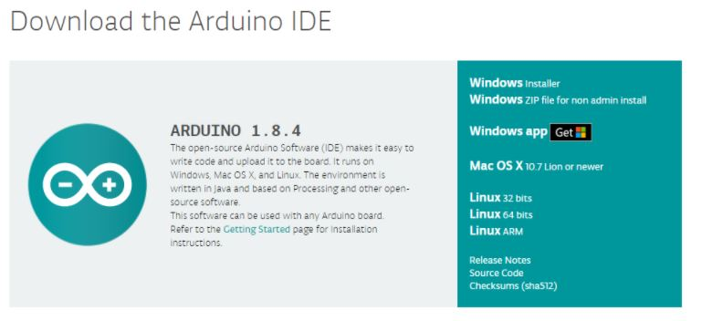
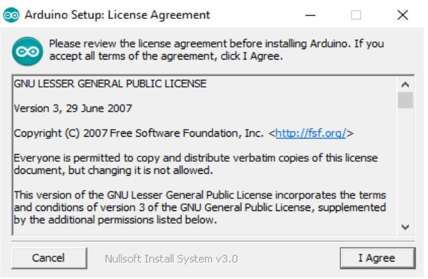
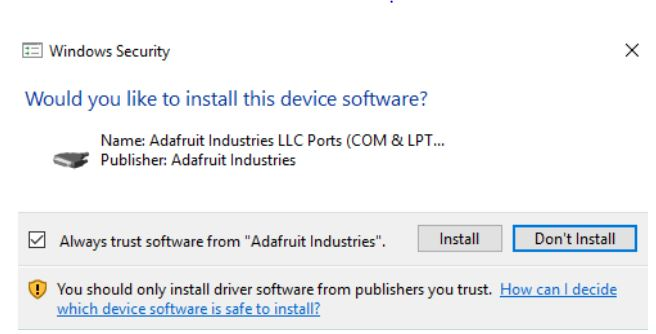
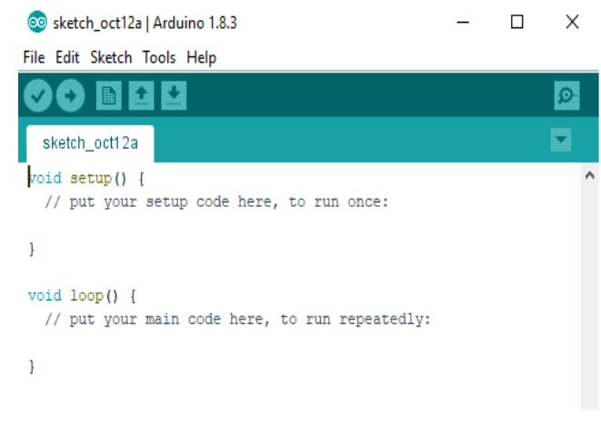

# Installation

Steps and software need to code, compile is elaborated here.

# Source

[https://arduino.sincgrid.com/docs/build/html/files/lecture2/index.html](https://arduino.sincgrid.com/docs/build/html/files/lecture2/index.html)

## Arduino IDE

- **Free and Open-source**
- **Easy-to-use**
- **Compatible** 
- **Easy-to-understand**
- **Reliable**

## Download
- To download the Arduino IDE, open url `<https://www.arduino.cc/en/Main/Software>`_.
- Now select the download file based on your operating system.

    

    
## Installations 

### Installation (Windows)

- Now click on the downloaded file to start the installation.

    
- Now accept the license agreement by clicking on I Agree button.

    
- Click on Next to install various components of Arduino IDE Setup.

    
- Now select the directory for installation and click Install button. 

    
- The following dialogue box appears, click Close after the installation is completed.

    
- If the drivers are not pre-installed on your desktop, then a series of driver installation dialog box will appear. Click Install to install the necessary drivers.

    
- The installation has been completed. 
- Now click on the desktop icon to start the Arduino IDE.

    

### Installation (Linux)

- Extract the downloaded package. 

    
- In the extracted folder, find the install.sh file.
- Right click on it and chose the Run in Terminal from contextual menu.

    
- If you can’t find the Run in Terminal option from contextual menu, then open Terminal and navigate to the extracted folder
- Type the command ./install.sh and wait for the process to finish
- Now, the Arduino IDE has been installed

    
- It might be the case that you would not be able to upload the sketch because of serial port permission. The corresponding error message is **”Error connecting to Serial Port”**
- To set the permission, open Terminal and type ** ls -l /dev/ttyACM* **
- The data we need is ‘dialout’(this is the group owner of the file)
- Now we need to add our user to that group with the help of the following command  ** sudo usermod -a -G dialout < username > **

    

### Installation (Mac OS X)

- Extract the downloaded package. 

    
- Copy the Arduino application into the Applications folder or any other location. 

    
- The installation has been completed. 
- Now click on the Arduino icon to start the Arduino IDE.

    

## User Interface

    
### File Tab and Edit Tab

    
### Sketch Tab and Tools Tab

    
### Meaning of Symbols-Verify

    
### Upload

    
### New

    
### Open

    
### Save

    
### Serial Monitor

    
## Functions

    