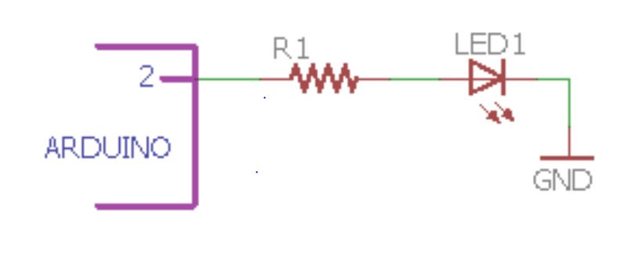

# Digital Output
DigitalWrite command will be use to activate this operations.

In this experiment we will blink led using digitalwrite

## Target units that can be interfaced


    

## VOLTAGE LEVELS
- **2V-3.3V - HIGH LOGIC LEVEL**
- **0V-0.8V- LOW LOGIC LEVEL**

## WHAT IS AN LED?

    


    

## Resistor Selection

    

## EXERCISE
- To make the LED blink at different rates

## HARDWARE

    

## SOFTWARE
```cpp title="Digital Operations"
void setup() {
  // initialize digital pin 2 as an output.
  pinMode(2, OUTPUT);
}

// the loop function runs over and over again forever
void loop() {
  digitalWrite(2, HIGH);   // turn the LED on (HIGH is the voltage level)
  delay(1000);                       // wait for a second
  digitalWrite(2, LOW);    // turn the LED off by making the voltage LOW
  delay(1000);                       // wait for a second
}
```