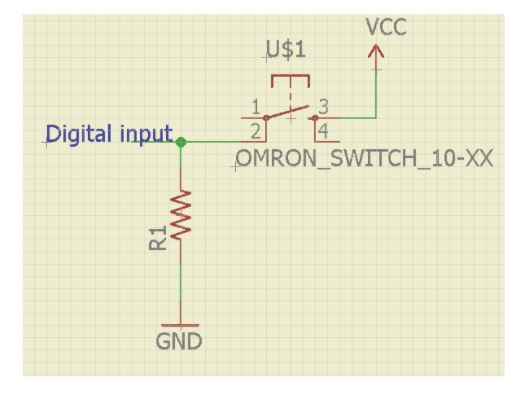

# Digital input

## Digital input

digitalRead command will be used to perform this.

In many cases, you only need to know one thing about the physical world: Whether something is true or false. Is the viewer in the room or out? Are they touching the table or not? Is the door open or closed? In these cases, you can determine what you need to know using a digital input, or switch.
Digital inputs have two states: off and on. If voltage is flowing, the circuit is on. If it’s not flowing, the circuit is off. To make a digital circuit, you need a circuit, and a movable conductor which can either complete the circuit, or not. 

## PULL UP Configuration


In pullup configuration, when switch is pressed then arduino digital pin is connected to ground. So, input pin will read it as logic low. When switch is released then pin is connected to vcc via a resistor. The pin will read it as logic high.

## PULL DOWN Configuration


In pulldown configuration, when switch is pressed then arduino digital pin is connected to vcc. So, input pin will read it as logic high. When switch is released then pin is connected to ground via a resistor. The pin will read it as logic low.

## Hardware
Connect one led with resistor in series to pin 2 and push button in one down configuration

## Software
```cpp title="Digital Input Operations"
// constants won't change. They're used here to set pin numbers:
const int buttonPin = 2;     // the number of the pushbutton pin
const int ledPin =  13;      // the number of the LED pin

// variables will change:
int buttonState = 0;         // variable for reading the pushbutton status

void setup() {
  // initialize the LED pin as an output:
  pinMode(ledPin, OUTPUT);
  // initialize the pushbutton pin as an input:
  pinMode(buttonPin, INPUT);
}

void loop() {
  // read the state of the pushbutton value:
  buttonState = digitalRead(buttonPin);

  // check if the pushbutton is pressed. If it is, the buttonState is HIGH:
  if (buttonState == HIGH) {
    // turn LED on:
    digitalWrite(ledPin, HIGH);
  } else {
    // turn LED off:
    digitalWrite(ledPin, LOW);
  }
}
```