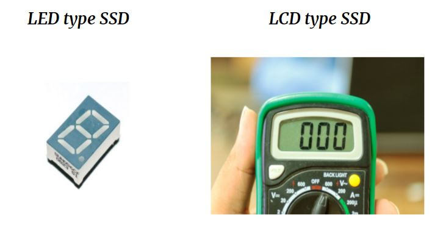
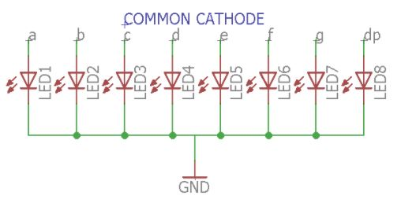
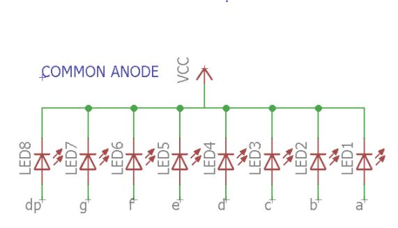
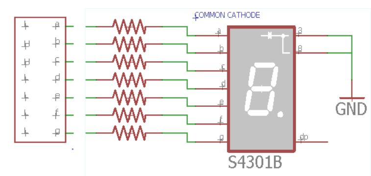
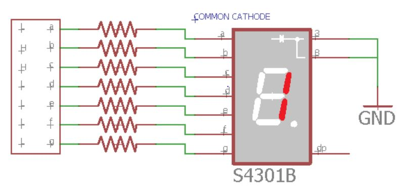
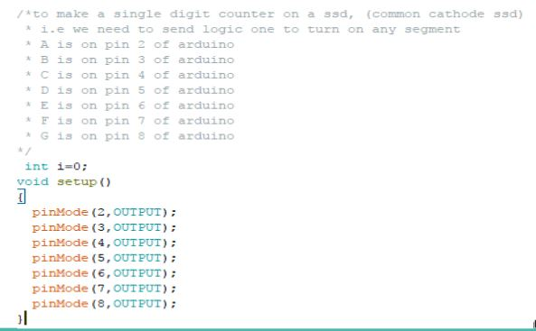

# SSD
Introduction to SSD

## SEVEN SEGMENT DISPLAY(SSD)

### WHAT IS SSD?

Seven Segment Display (SSD) or seven segment Indicator is an electronic device which helps display decimal numerals and English alphabets.

### TYPES OF SSD

### COMMON CATHODE SSD

In common cathode all the cathodes are tied to a common pin, in this case generally ground, and the LED are driven by the state of the anodes where ground is off and power is on.

### COMMON ANODE SSD

In common anode all the anodes on the display are tied to a common pin, typically the power source, and the LED are controlled via the cathodes with ground being on and power being off.

### DRIVING A LED TYPE SSD

### EXERCISE
- To make a single digit counter

#### HARDWARE

When we write digital high on pins of arduino the current flows and led’s are turned on.

#### SOFTWARE

A basic arduino code will involve two functions for sure: setup and loop. Setup function does not return any value and accepts no parameters. It is used to initialize our hardware. 

### Practice Problem
- Make a four digit counter using four digit seven segment display