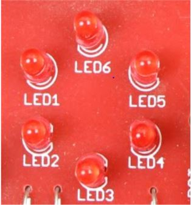
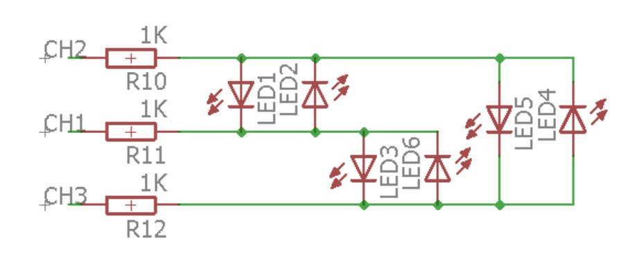
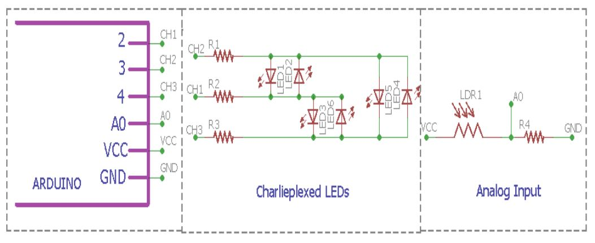
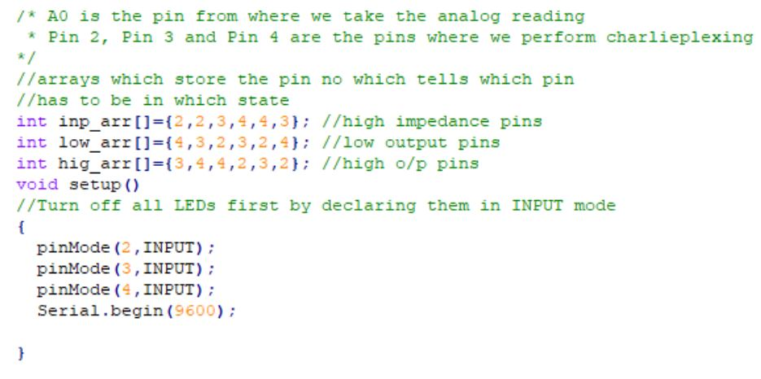
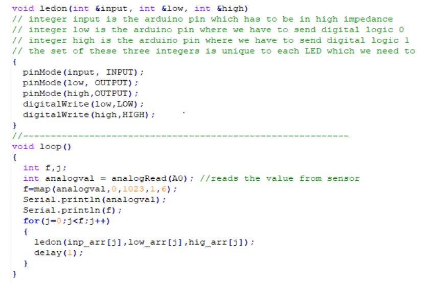

# CHARLIEPLEXING

Charlieplexing is a technique for driving a multiplexed display in which relatively few I/O pins on a microcontroller are used e.g. to drive an array of LEDs.

## CHARLIEPLEXING

    
Charlieplexing is a technique used to drive multiplexed display using the tri state logic of a microcontroller.

## SCHEMATIC

    

## Charlieplexing vs Multiplexing?

**Problems with Charlieplexing:**
- Requirement of tri state logic
- Refresh rate
- Cannot be used to drive higher number of LEDs
- Cannot use LEDs with different forward voltages

### Exercise

- Based on the Analog Input change the number of LED which turns on

### HARDWARE

    

### SOFTWARE

    

    