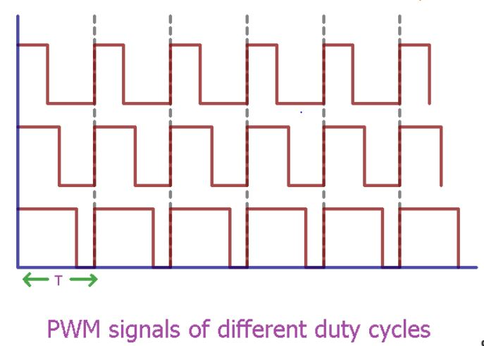
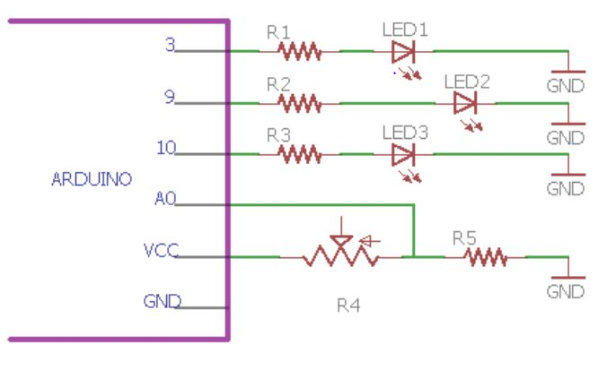
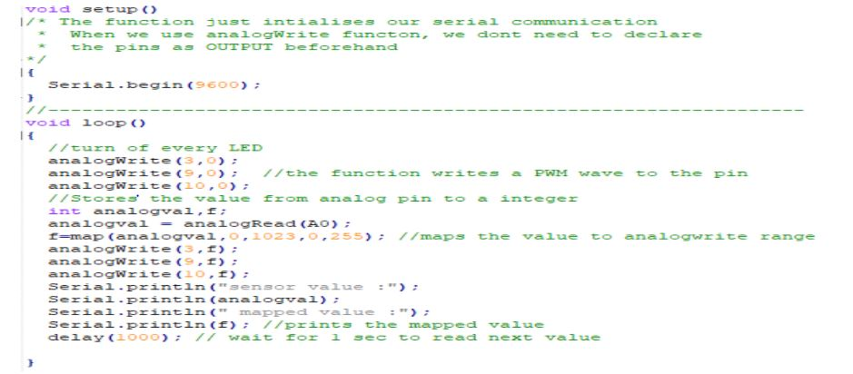

# PWM - OPERATIONS

Pulse-width modulation, or pulse-duration modulation, is a method of reducing the average power delivered by an electrical signal, by effectively chopping it up into discrete parts. The average value of voltage fed to the load is controlled by turning the switch between supply and load on and off at a fast rate

## Pulse Width Modulation(PWM)

    

    

### EXERCISE:

- Based on Analog Input change the intensity of the three different LEDs 

### HARDWARE

    
**~** This symbol should be in front of the pins because on Arduino PWM wave is enabled on these

### SOFTWARE

    