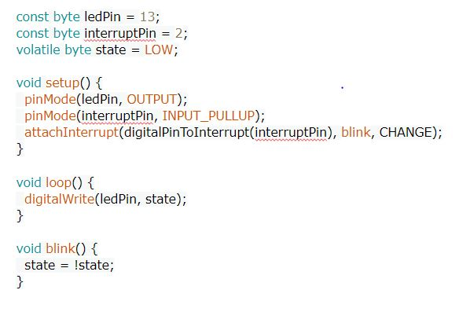

# Interrupt

Interrupts are the events that temporarily suspend the main program, pass the control to the external sources and execute their task.

## INTRODUCTION TO INTERRUPTS

The first parameter to attachInterrupt() is an interrupt number. Normally you should use digitalPinToInterrupt(pin) to translate the actual digital pin to the specific interrupt number. For example, if you connect to pin 3, use digitalPinToInterrupt(3) as the first parameter to attachInterrupt().

## DELAYS AND MILLIS USAGE

Inside the attached function, delay() won’t work and the value returned by millis() will not increment. Serial data received while in the function may be lost. You should declare as volatile any variables that you modify within the attached function. See the section on ISRs below for more information.

### USAGE
Interrupts are useful for making things happen automatically in microcontroller programs, and can help solve timing problems. Good tasks for using an interrupt may include reading a rotary encoder, or monitoring user input.

### Software
