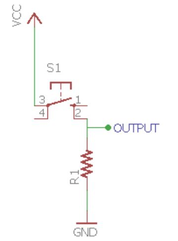
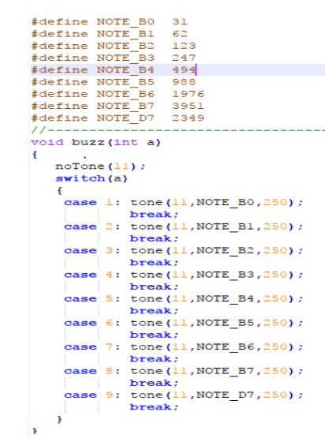
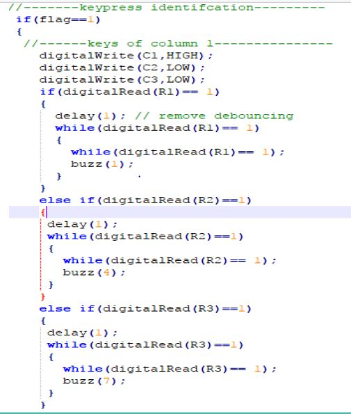

# KEYPAD 
There many kind of keypads in Arduino. So you can use any kind of Arduino keypads.
There are some images of keypad.

## KEYPAD INTERFACING

    

### HIGH SIDE SWITCHING

    

### LOW SIDE SWITCHING

    

### KEYPAD CONNECTIONS

    

### EXERCISE

- Based on switch array input change the frequency of sound at which the buzzer beeps

## HARDWARE

    

## SOFTWARE

    

    

    

## Practise Exercise

- Based on switch array set some tone