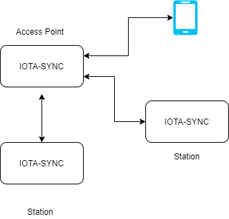

#  WiFi Access point

The esp8266 is able to be configured as an access point (AP) and generate its own wifi network with ssid and password. This method is useful when you do not have access to a wifi network or if you want to work on a network specific to the microcontroller.
<div style={{textAlign: 'center'}}>



</div>

```cpp title="WiFi Access Point"
#include <ESP8266WiFi.h>
#include <WiFiClient.h>
#include <ESP8266WebServer.h>

#ifndef APSSID
#define APSSID "sincgrid"
#define APPSK  "sincgrid.com"
#endif

/* Set these to your desired credentials. */
const char *ssid = APSSID;
const char *password = APPSK;

ESP8266WebServer server(80);

/* Just a little test message.  Go to http://192.168.4.1 in a web browser
   connected to this access point to see it.
*/
void handleRoot() {
  server.send(200, "text/html", "<h1>You are connected</h1>");
}

void setup() {
  delay(1000);
  Serial.begin(115200);
  Serial.println();
  Serial.print("Configuring access point...");
 
 
  WiFi.softAP(ssid, password);

  IPAddress myIP = WiFi.softAPIP();
  Serial.print("AP IP address: ");
  Serial.println(myIP);
  server.on("/", handleRoot);
  server.begin();
  Serial.println("HTTP server started");
}

void loop() {
  server.handleClient();
}
```