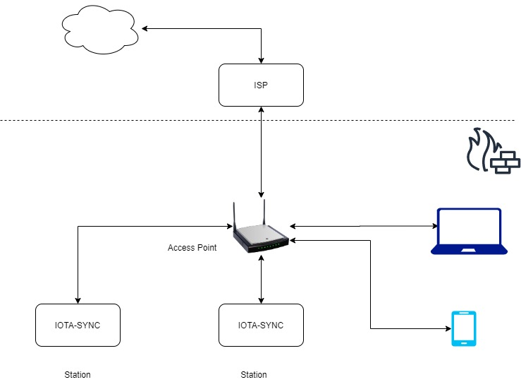

#  WiFi Station Mode

Station Mode (STA) is what most people would consider the normal mode for a WiFi device. A device uses Station Mode to join a network that already exists, exactly like your smartphone does when its connects to your WiFi network at home




```cpp title="WiFi Station Mode : get request example"


#include <ESP8266WiFi.h>
#include <ESP8266HTTPClient.h>
 
const char* ssid = "sincgrid";
const char* password = "sincgrid.com";
 
void setup () {
 
  Serial.begin(115200);
 
  WiFi.begin(ssid, password);
 
  while (WiFi.status() != WL_CONNECTED) {
 
    delay(1000);
    Serial.print(".");
 
  }
 
}
 
void loop() {
 
  if (WiFi.status() == WL_CONNECTED) { //Check WiFi connection status
 
    HTTPClient http;  //Declare an object of class HTTPClient
 
    http.begin("https://reqres.in/api/users?page=2");  //Specify request destination
    int httpCode = http.GET();                                  //Send the request
 
    if (httpCode > 0) { //Check the returning code
 
      String payload = http.getString();   //Get the request response payload
      Serial.println(payload);             //Print the response payload
 
    }
 
    http.end();   //Close connection
 
  }
 
  delay(10000);    //Send a request every 10 seconds
}
```