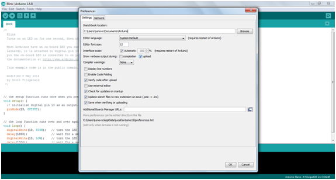
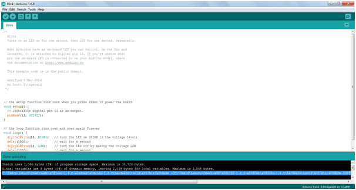
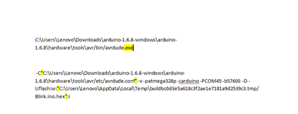

# 00 Setting up enviroment
Install an IDE to compile our source code and burn to device.

Source :- [http://sincgrid.in/avr-tutorials/avr-tutorial-environment-setup-avr-studio/](http://sincgrid.in/avr-tutorials/avr-tutorial-environment-setup-avr-studio/)


## Software Setup:

Download Microchip Studio 7 from official website of Atmel (www.microchip.com) and install it. Here are some simple steps to start with:

(1) Start Arduino IDE.
(2) Open any example code.
(3) Go to preferences (in File Tab) and check the show the output verbose during “upload” checkbox as shown in figure below.

<div style={{textAlign: 'center'}}>



</div>
(4) Click OK.
(5) Now upload the sketch to arduino board.
(6) When uploading is done, scroll the output window and copy the upload command as shown.

<div style={{textAlign: 'center'}}>



</div>
(7) Now paste it in NotePad.

(8) This command has two parts. First is the program used to upload the sketch. And second is the argument or parameters used. We have to separate these two.

(9) Replace avrdude with avrdude.exe and press enter button. This is the first part.

(10) Now place the file names in quotation marks as shown.

<div style={{textAlign: 'center'}}>



</div>

(11) Changes are shown here using yellow highlighter.

(12) Now the replace the second file by $(ProjectDir)Debug$(TargetName).hex this is second part.

<div style={{textAlign: 'center'}}>


</div>
(13) Again changes are shown using yellow highlighter.

(14) Now start New Project in Atmel Studio 7. And select ‘Atmega 328P’ device.

(15) Go to tools–>external tools

```cpp 
Command :
C:\Program Files (x86)\Arduino\hardware\tools\avr/bin/avrdude.exe

Arguments:

-C”C:\Program Files (x86)\Arduino\hardware\tools\avr/etc/avrdude.conf” -v -patmega328p -carduino -PCOM41 -b57600 -D -Uflash:w:”$(ProjectDir)Debug\$(TargetName).hex”:i
```

(16) Enter a suitable title in title box.

(17) Copy the first part obtained in 9th step in the command box and part2 obtained in 12th step in arguments box. At last check the ‘use output window’ checkbox. Click OK.

The Atmel Studio is ready to write and run codes.