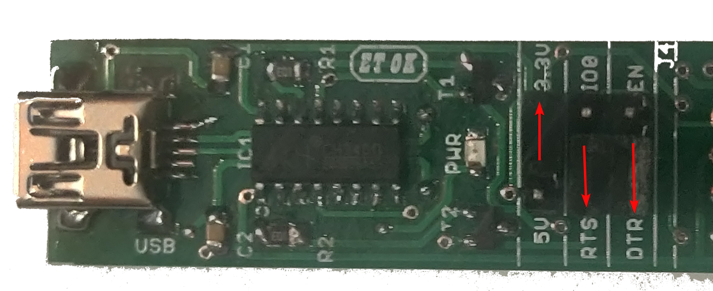

# IOTA-SYNC 2

.png)

IOTA-SYNC is a platform to teach the embedded system basics and Internet of things applications. This IOTA-SYNC 2 is second board in this series. This variant of the board uses AVR (Atmega328P), ESP8266 and SIM800L.  Both MCUs operates at 3.3V voltage logic level same as that of sim800L to make the development more easier. Pin naming are mentioned in both AVR port naming scheme as well as that of Arduino platform naming scheme to save time while development.

Earlier variant of this board exposes ESP32 (WiFi, Bluetooth), NFC and LORA.

## Where to buy?

[Sincgrid Store link](https://store.sincgrid.com/index.php?route=product/product&product_id=322)

Contact us at sales@sincgrid.com for college/bulk discounts.

## Know about hardware blocks

## Getting started with the board
To get started with the programming with this board user need to use some IDE like Arduino ide, VScode (with platform io), Microchip Studio etc. Arduino Ide is recommended for the beginner.

After writing the source code, like the examples provided and compiling. Use need a hardware to transfer the binary code generated in computer the iotasync2 hardware. To do user need a hardware named progrid. This hardware is provided with the iotasync 2 kit. 

User can connect the hardware in the location shown with the arrow.

.png)

** IOTA-SYNC2 Progrid connection **

### Programming the AVR IC

In order to program the Atmega328P ic, user need to make the jumper orientation on progrid as shown in the image. 
The idea over here is, we are using the DTR and RTS pins of progrid to program the AVR ic. This configuration invokes a signal in AVR ic's bootloader installed  to start accepting the program provided by the IDE.

** Progrid jumper orientation needed for the AVR programming **

Once done connect the progrid header to the AVR prog. header marked in the IOTA-SYNC2 Board, on bottom left side. Do take notice of pin to mapping mentioned on both progrid and IOTA-SYNC2 board.

** Caution: Do note that vcc is set to 3.3V only, as AVR ic running on 3.3V logic over here **

### Programming the ESP8266
 
In order to program the ESP8266 , user need to make the jumper orientation on progrid as shown in the image. 
The idea over here is, we are using the IO0 and EN pins of progrid to program the ESP8266. This configuration invokes a signal in ESP8266 to start accepting the program provided by the IDE.

** Progrid jumper orientation needed for the ESP programming **

Once done connect the progrid header to the ESP prog. header marked in the IOTA-SYNC2 Board, on bottom right side. Do take notice of pin to mapping mentioned on both progrid and IOTA-SYNC2 board.

** Caution: Do note that vcc is set to 3.3V only, as ESP8266 ic running on 3.3V logic **

### SIM800L to ESP8266 Communication

As shown in the [hardware block of the board](#know-about-hardware-blocks), SIM800L and ESP8266 boards are communicating via UART. This provision made optional on the board to facilitate the user, to use same pin on ESP8266 for some other purpose. 

To use this us have to short the two pins in **vertical manner** as shown in the image below, ie. TX to I05 and RX to I04.

.png)

There after use the serial monitor on the IO5 and IO4 from ESP8266 side.

** Caution: I05 and I04 on ESP8266 side are same pins which are used for I2C. so make sure that its pulled up from backside  before using. **

### AVR IC to ESP8266 Communication
As shown in the [hardware block of the board](#know-about-hardware-blocks), AVR and ESP8266 boards are communicating via UART. This provision made optional on the board to facilitate the user, to use same pin on ESP8266 for some other purpose. 

To use this us have to short the two pins in **Horizontal manner** as shown in the image below, ie. PD3 to Io14 and PD2 to IO12.

There after use the serial monitor on the IO14 and IO12 from ESP8266 side and PD3(D3) and PD2(D2) on AVR side.

** Caution: I05 and I04 on ESP8266 side are same pins which are used for SPI. **

## Arduino's List of experiments

Arduino IDE (https://arduino.sincgrid.com/docs/build/html/index.html)

1. [INTRODUCTION](https://arduino.sincgrid.com/docs/build/html/files/lecture1/index.html)
2. [INSTALLATION](https://arduino.sincgrid.com/docs/build/html/files/lecture2/index.html)

### List of experiments that can be performed used AVR in Arduino framework
1. [DIGITAL OPERATIONS](https://arduino.sincgrid.com/docs/build/html/files/lecture3/index.html)
2. [DIGITAL INPUTS](https://arduino.sincgrid.com/docs/build/html/files/lecture4/index.html)
3. [INTRODUCTION TO SSD](https://arduino.sincgrid.com/docs/build/html/files/lecture5/index.html)
4. [ANALOG OPERATIONS](https://arduino.sincgrid.com/docs/build/html/files/lecture6/index.html)
5. [CHARLIEPLEXING](https://arduino.sincgrid.com/docs/build/html/files/lecture7/index.html)
6. [PWM - OPERATIONS](https://arduino.sincgrid.com/docs/build/html/files/lecture8/index.html)
7. [INTRODUCTION TO INTERRUPTS](https://arduino.sincgrid.com/docs/build/html/files/lecture9/index.html)
8. [BUZZER INTRODUCTION](https://arduino.sincgrid.com/docs/build/html/files/lecture10/index.html)
9. [KEYPAD INTERFACING](https://arduino.sincgrid.com/docs/build/html/files/lecture11/index.html)
10. [LCD INTERFACING](https://arduino.sincgrid.com/docs/build/html/files/lecture12/index.html)

## AVR (Embedded C) list of experiments

AVR documentation (http://sincgrid.in/avr-tutorials/)

1. [Flash led at observable rate](http://sincgrid.in/avr-tutorials/avr-tutorial-experiment-1/)
2. [Hello LED](http://sincgrid.in/avr-tutorials/avr-tutorial-experiment-2/)
3. [LED with switch](http://sincgrid.in/avr-tutorials/avr-tutorial-experiment-3/)
4. [Random number generator](http://sincgrid.in/avr-tutorials/avr-tutorial-experiment-4/)
5. [LED toggle with Timer](http://sincgrid.in/avr-tutorials/avr-tutorial-experiment-5/)
6. [Intensity variation of LED based on potentiometer value](http://sincgrid.in/avr-tutorials/avr-tutorial-experiment-6/)
7. [Creating different colors using RGB LEDs](http://sincgrid.in/avr-tutorials/avr-tutorial-experiment-7/)
8. [LDR values on serial monitor](http://sincgrid.in/avr-tutorials/avr-tutorial-experiment-8/)
9. [Automatic Porch Light](http://sincgrid.in/avr-tutorials/avr-tutorial-experiment-9/)
10. [Thermistor value on serial monitor](http://sincgrid.in/avr-tutorials/avr-tutorial-experiment-10/)

### List of experiments that can be performed used AVR in embedded C

| EXPERIMENT NUMBER 	| EXPERIMENT                                                                                                                                                               	| BOARD REQUIRED 	|
|-------------------	|--------------------------------------------------------------------------------------------------------------------------------------------------------------------------	|----------------	|
| 1                 	| Flash LED at an observable rate.                                                                                                                                         	| MV1            	|
| 2                 	| Hello LED – Flash LED at a rate such that the LED appears always on. Estimate the onset of the rate when the LED appears to stay on                                      	| MV1            	|
| 3                 	| Controlling ON/OFF of an LED using switch                                                                                                                                	| MV1 OR MV2     	|
| 4                 	| Use LFSR based random number generator to generate a random number and display it                                                                                        	| MV1 OR MV2     	|
| 5                 	| Toggle the LED every second using Timer interrupt                                                                                                                        	| MV1            	|
| 6                 	| Use the potentiometer to change the red LED intensity from 0 to maximum in 256 steps                                                                                     	| MV1            	|
| 7                 	| Use the switch to select the LED (from RGB led) and then the potentiometer to set the intensity of that LED and thus create your own color from amongst 16million colors 	| MV1            	|
| 8                 	| Read the ADC value of the voltage divider involving the LDR. Print the value on the serial monitor                                                                       	| MV1            	|
| 9                 	| Use the LDR and estimate a threshold for the LDR value and use that to turn the RGB LED on, to simulate an ‘automatic porch light’                                       	| MV1            	|
| 10                	| Use the thermistor to estimate the temperature and print the raw value on the serial monitor                                                                             	| MV1            	|
| 11                	| Connect the LCD I/O Board and print ‘Hello World’ on the LCD. Scroll display from left to right                                                                          	| MV2            	|
| 12                	| Use the on-board EEPROM to store the temperature min and max values together with a time stamp                                                                           	| MV2            	|
| 13                	| Speed control of D.C. motor                                                                                                                                              	| MV3            	|
| 14                	| Speed control of Stepper motor                                                                                                                                           	| MV3            	|